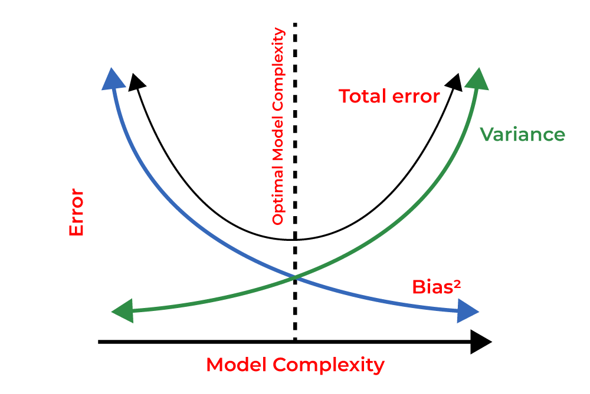
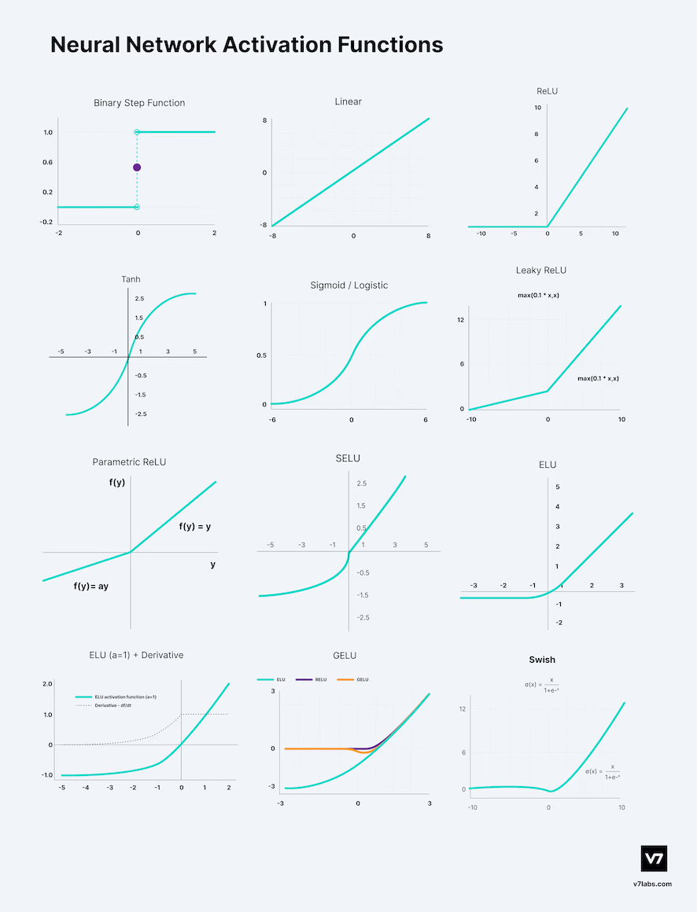
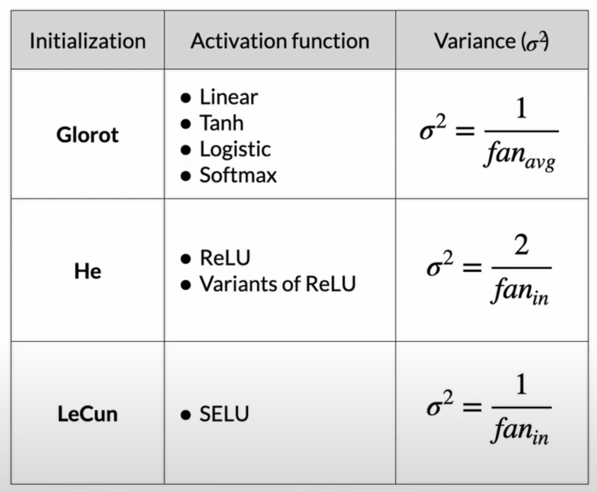
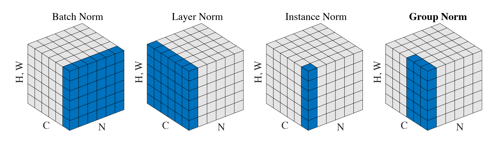
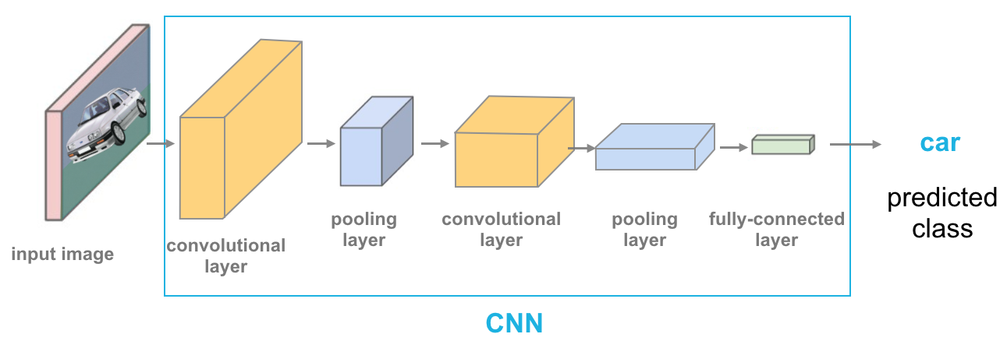
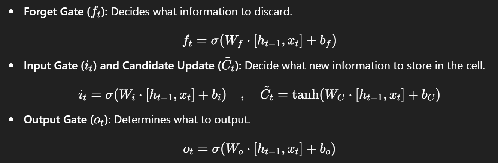
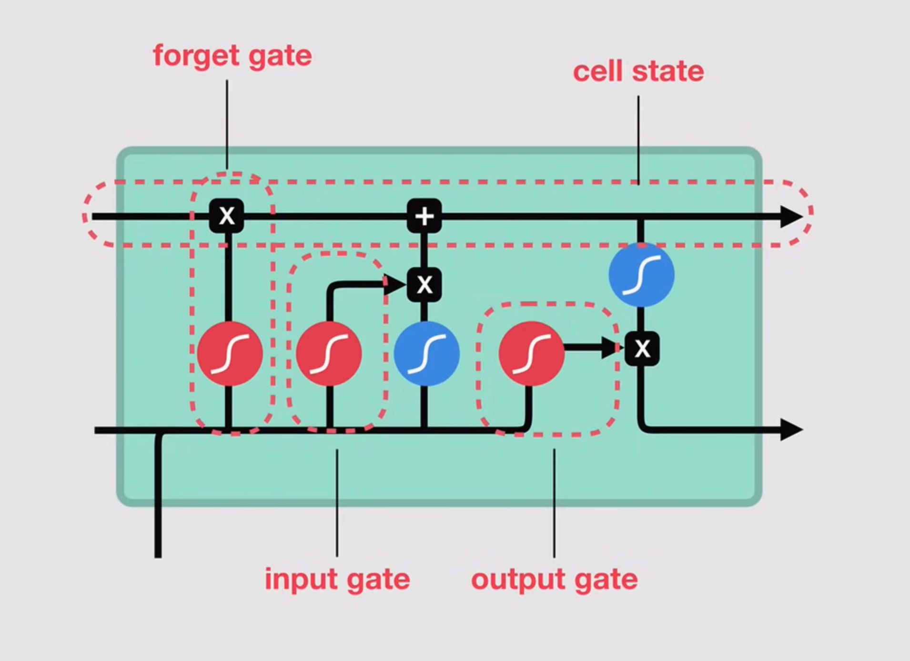
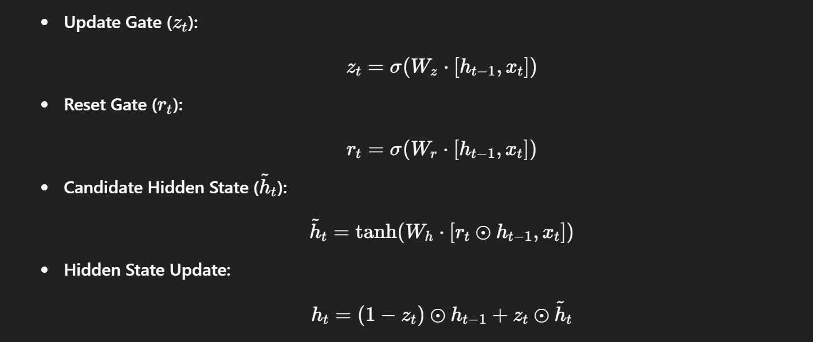
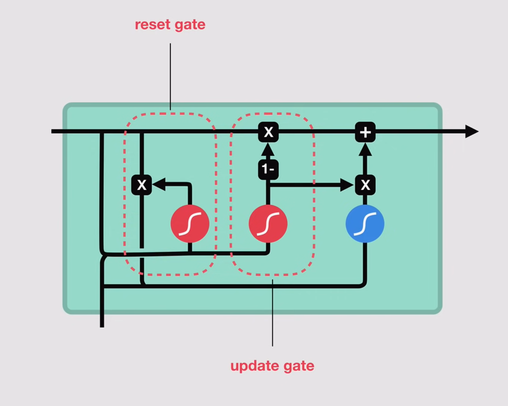

# PhD-ML-DL-LLM-Interview-Handbook

## Table of Contents

- [Machine Learning](#Machine-Learning)
    - [ML Basic](#ML-Basic)
    - [ML Algorithms](#ML-Algorithms)
        - [Algorithm Categories](#Algorithm-Categories)  
        - [Supervised Learning](#supervised-Learning)  
        - [Unsupervised Learning](#Unsupervised-Learning)  
    - [XAI](#xai)

- [Deep Learning](#Deep-Learning)
    - [DL Basic](#dl-basic)
    - [DL Algorithms](#dl-algorithms)
        - [CNN](#cnn)
        - [RNN](#rnn)
        - [LSTM & GRU](#lstm--gru)
        - [Generative Models](#generative-models-gans--autoencoders)
        - [Transformers](#transformer)

- [Natural Language Processing](#nlp)

- [Large Language Models](#Large-Language-Models)


 

----


## Machine Learning

### ML Basic
#### Gradient descent
- (Batch) Gradient descent [[ref](https://machinelearningmastery.com/gradient-descent-for-machine-learning/)] [[B站](https://www.bilibili.com/video/BV1jh4y1q7ua/?spm_id_from=333.337.search-card.all.click&vd_source=c86f14ec33e79f08f7e2278747a071e8)]
    - The gradient $\left(\nabla_\theta J(\theta)\right)$ represents the direction of steepest ascent-the direction where the function increases the fastest. Gradient gives the direction of steepest ascend. So to minimize the function, take steps in the opposite direction.
    - Gradient descent is an optimization algorithm used to find the values of parameters (coefficients) of a function (f) that minimizes a cost function (cost).
    - formula: $$\theta = \theta - \alpha \nabla_\theta J(\theta)$$, where $\theta:$ Parameters to be optimized. $\alpha$ : Learning rate (step size). $\nabla_\theta J(\theta)$ : Gradient of the cost function w.r.t. parameters.

- GD Variants
    - (Batch) GD: All data points at once
    - SGD: one data point per iteration
        - Updates parameters using only one randomly chosen training example at each step.
        - Formula: $$\theta=\theta-\alpha \nabla_\theta J\left(\theta ; x^{(i)}, y^{(i)}\right)$$.
    - Mini-batch GD: Small subset per iteration.
    - Cons:
        - Sensitivity to learning rate
        - Risk of getting stuck at saddle points
        - Premature convergence in flat regions: local minimum.

All following advanced optimization algorithms improve parameter updates by adjusting both the **gradient calculation (gc)** and the **learning rate strategy (lr)**.

- **Momentum (gc)** enhances standard gradient descent by adding a velocity term that accumulates past gradients. This velocity term smooths the updates, reducing oscillations and accelerating convergence, particularly in scenarios with noisy gradients or ill-conditioned optimization surfaces.
    - Pros: faster, jump out of local minimum, stable training.

- Nesterov Accelerated Gradient (TBD)

- **Adagrad (lr)** uses adaptive learning rates for each parameter, automatically adjusting LR during training. Larger learning rates for infrequent parameters, smaller rates for frequent parameters.
    - Formula:  $$G_t=G_{t-1}+\left(\nabla_\theta J(\theta)\right)^2, \quad \theta=\theta-\frac{\alpha}{\sqrt{G_t+\epsilon}} \nabla_\theta J(\theta)$$

- **RMSprop (lr)**: Adagrad adapts the learning rate individually for each parameter, but its main drawback is the continual accumulation of squared gradients. Over time, this causes the learning rate to shrink excessively, sometimes stopping learning prematurely. RMSprop addresses this limitation by introducing an exponential moving average of squared gradients instead of a cumulative sum. This prevents the learning rate from becoming excessively small over time, making RMSprop better at handling non-stationary problems and maintaining stable and efficient convergence.


- **Adam**: Adam combines the advantages of (1)Momentum (first-order moment): Helps smooth updates, and (2) RMSprop (second-order moment): Provides adaptive per-parameter learning rates.
    Step 1: Calculate biased moments
    - First moment estimate (mean of gradients):

        $$m_t=\beta_1 m_{t-1}+\left(1-\beta_1\right) \nabla_\theta J(\theta)$$

    - Second moment estimate (mean of squared gradients):

        $$v_t=\beta_2 v_{t-1}+\left(1-\beta_2\right)\left(\nabla_\theta J(\theta)\right)^2$$


    Step 2: Correct bias (since initial values are zero):
    - $$\hat{m}_t=\frac{m_t}{1-\beta_1^t}, \quad \hat{v}_t=\frac{v_t}{1-\beta_2^t}$$


    Step 3: Parameter update:
    - $$\theta=\theta-\frac{\alpha}{\sqrt{\hat{v}_t}+\epsilon} \hat{m}_t$$


        Typical default values:
        - $\beta_1=0.9, \beta_2=0.999, \epsilon=10^{-8}$


- AdamW: Adam combines adaptive learning rates (like RMSprop) with momentum, leading to fast, efficient convergence. However, its implicit handling of weight decay can hurt generalization. AdamW improves upon Adam by explicitly decoupling weight decay from gradient-based updates, resulting in better regularization and improved generalization—making AdamW particularly beneficial for training large, modern models like transformers.

- Muon (Recent): Muon is an optimizer tailored for optimizing the hidden layers of neural networks, specifically focusing on 2D weight matrices (e.g., those in linear and convolutional layers). It operates by applying a Newton-Schulz iteration to the momentum-based gradient updates, effectively orthogonalizing them before applying to the weights. This orthogonalization helps in maintaining diverse directions in the parameter updates, which can lead to better convergence properties. [[GitHub](https://github.com/KellerJordan/Muon?utm_source=chatgpt.com)]

| Method | Adaptive LR | Momentum | Memory | Stability | Typical Use |
|--------|-------------|----------|--------|-----------|-------------|
| SGD | ❌ No | ❌ No | Low | Medium | Fast updates |
| Momentum | ❌ No | ✅ Yes | Low | Medium | Reduces oscillations |
| RMSprop | ✅ Yes | ❌ No | Medium | High | Adaptive LR |
| Adam | ✅ Yes | ✅ Yes | Medium | High | Most popular default |
| AdamW | ✅ Yes | ✅ Yes | Medium | High | Improved regularization |
| Muon | ✅ Yes | ✅ Yes | Low | High | Recent advancement |


#### Model evaluation and selection
- Evaluation
    - TP, FP, TN, FN

    - Metrics:
        - Accuracy: Overall correctness
        - Precision ($\frac{T P}{T P+F P}$): Out of predicted positives, how many were actually positive?
        - Recall/sensitivity/TPR ($\frac{T P}{T P+F N}$): 	Out of actual positives, how many were predicted correctly?
        - Specificity/TNR ($\frac{T N}{T N+F P}$): Out of actual negatives, how many were correctly predicted negative?
        - F1-score ($2 \times \frac{\text { Precision } \times \text { Recall }}{\text { Precision }+ \text { Recall }}$): Harmonic mean balancing precision and recall. For multi-class problems, use macro or weighted averages. 
        - **How to choose**: Accuracy is misleading with imbalanced data. Precision, if avoiding false positives is crucial (e.g., spam detection). Recall (Sensitivity), if missing a positive case is costly (e.g., cancer detection, fraud detection). F1-score, if both precision and recall matter equally. Specificity, if correctly identifying negative cases is essential (medical tests).
        - Precision vs Recall: Precision clearly matters when the cost of a FP is high. (e.g., classifying email as spam—high precision avoids wrongly marking important emails). Recall (TPR) clearly matters when the cost of missing positives (FN) is very high (e.g., disease diagnosis—high recall ensures positive cases aren't missed).

    - ROC (Receiver Operating Characteristic) curve (TPR vs FPR, threshold selection)
        - ROC curve plots TPR (Recall) vs FPR (1 - Specificity) at various threshold levels.Y-axis (TPR/Recall): Correctly identified positives; X-axis (FPR): Incorrectly identified positives (False Alarms). Choose threshold clearly to maximize TPR and minimize FPR.
    - AUC (model comparison)
        - AUC clearly measures the model’s overall capability to distinguish classes irrespective of threshold. Model with higher AUC is generally better at distinguishing classes clearly.
        - Range [0.5, 1]
    - Confusion matrix: Confusion matrix clearly visualizes all predictions vs actual classes:

    <div align="center">
        
    </div>

- Bias/Variance [[ref](https://traintestsplit.com/bias-vs-variance-in-machine-learning/)]
    - Bias: The bias is the simplifying assumption made by the model to make the target function easy to learn. Low bias suggests fewer assumptions made about the form of the target function. High bias suggests more assumptions made about the form of the target data. The smaller the bias error the better the model is. If, however, it is high, this means that the model is **underfitting** the training data. 
    - Variance: Variance is the amount that the estimate of the target function will change if different training data was used. The target function is estimated from the training data, so we should expect the algorithm to have some variance. Ideally, it should not change too much from one training dataset to the next. This means that the algorithm is good at picking out the hidden underlying mapping between the inputs and the output variables. If the variance error is high this indicates that the model **overfits** the training data.
    - If our model is too simple and has very few parameters then it may have high bias and low variance. On the other hand if our model has large number of parameters then it’s going to have high variance and low bias. So we need to find the right/good balance without overfitting and underfitting the data. 

    <div align="center">
        
    </div>

    - Underfitting/overfitting
        - Underfitting occurs when the model is too simple to capture underlying data trends. Solution:Increase model complexity (e.g., add features, use more complex models, reduce regularization).
        - Overfitting occurs when the model captures noise or random fluctuations (memorize every single detail) in training data. Solution: Reduce model complexity (e.g., remove features, apply regularization, use simpler models); Increase training data size; Early stopping.
    - Regularization: Regularization, such as L1 (LASSO) or L2 (Ridge), can be used to control model complexity to prevent overfitting and tackle high variance. They work by adding a penalty term to the magnitude of the coefficients.
        General form of regularized loss function:

        =\operatorname{Loss}_{\text{original}}(w)+\lambda\cdot{R}(w))


        - L0 is a technique in ML to encourage sparsity in a model's parameters. It penalizes the number of **non-zero parameters** in a model.

            )

            Use case: Feature Selection: L0 regularization is particularly useful in scenarios where the number of features is large, and only a small subset is expected to be relevant. It helps to automatically select a subset of features that contribute significantly to the model's performance.

        - L1 penalizes **absolute magnitude** of weight: 

            

            Encourages sparsity through geometry.
        
        - L2 penalizes **square magnitude** of weights:

            

            Penalizes large weights heavily, encourges smaller, diffuse weigths. Handles correlated features better.

        - L-infinity penalizes the **largest absolute weight** (maximum norm):

            

            Constrains the maximum coefficient magnitude, balancing all weights' magnitudes uniformly

        - When prefer L1 over L2? For explicit feature selection or interpretability
        - When prefer L2 over L1? L2 (Ridge) shrinks correlated features toward each other, effectively managing correlated features.
        - What happens as $\lambda \rightarrow \infty$ for L1 and L2?  For both: parameters approach zero; L1 produces exact zeros faster.
        - Is L0 convex? Why does it matter? No, it's non-convex. This matters due to optimization difficulty and computational complexity.


    - Feature selection: Proper Feature Selection removes irrelevant features thereby reducing both bias and variance. It can be done through various methods like backward elimination, forward selection, and recursive feature elimination.
        - Backward Elimination: Start with all features, then iteratively remove the least significant feature.
        - Forward Selection: Start with no features, then teratively add the most significant feature until no improvement.
        - Recursive Feature Elimination (RFE): Iteratively fits a model and removes least important features based on coefficients or importance metrics.
        - Embedded Methods (L1 Regularization / Lasso):
            - Feature selection happens simultaneously with model fitting

- Data
    - Missing data
        - MICE (Multiple Imputation by Chained Equations): It's an iterative method of imputing missing data where each missing feature is repeatedly modeled and filled based on other features. It creates multiple datasets to capture uncertainty properly.
    - Imbalanced data: Imbalanced data occurs when one class significantly outnumbers the other(s), causing biased models toward the majority class.
        - Oversampling: Duplicate minority examples 
            - SMOTE (Synthetic Minority Oversampling Technique): 1. Chooses a random minority instance; 2. Finds k nearest minority neighbors; 3. Creates synthetic points along the line segments joining neighbors.
            - ADASYN (Adaptive Synthetic Sampling): Generates more synthetic data for harder-to-classify minority instances (closer to majority class boundary).
        - Undersampling: Remove majority examples strategically.
            - ENN (Edited Nearest Neighbor): Removes majority samples misclassified by a k-NN classifier (noisy or ambiguous instances).

    - Distribution shifts: A distribution shift happens when the data seen during training differs from the data encountered during deployment or testing. It breaks the core assumption that train and test data come from the same distribution.
        - Covariate Shift (X changed): This occurs when the input distribution $P(x)$ changes, but the conditional distribution $P(y \mid x)$ stays the same. Example: A spam detection model trained on emails from last year might see different phrasing this year, even if what qualifies as spam hasn’t changed.

        - Label Shift (Y changed): Here, the label distribution $P(y)$ changes, but the distribution of features given the label $P(x \mid y)$ remains the same. Example: In medical data, the proportion of patients with a certain condition may increase in a new population.
        - Concept Drift (f changed): The conditional distribution $P(y \mid x)$ itself changes. Example: A recommendation model may degrade as user preferences evolve.

- Sampling
    - Uniform sampling selects items from a dataset with equal probability for all elements.  Code: random.sample(data,k).  Time Complexity: $O(k)$
    - Negative sampling primarily used in recommendation systems and NLP (Word2Vec) to train efficiently on sparse data. It reduce computational cost by sampling a subset of negative examples (items not interacted with or words not co-occurring). (Word2Vec)  Time Complexity: Reduces computation from $O(N)$ (all negatives) to $O(k)$ (sampled negatives).
    - Reservoir sampling: Technique to uniformly sample $k$ items from a stream or large unknown-size dataset in one pass.
        - Use Cases: Sampling from streaming data or very large files/databases.
        - Algorithm: Maintain a reservoir of size $k$. For first $k$ items: directly fill reservoir. For each subsequent item $i>k$ : With probability $k / i$, randomly replace an item in the reservoir.
        - Time: $O(N)$, single pass.
        - Memory: $O(k)$, fixed space.
    - Stratified sampling: Technique where the dataset is divided into distinct subgroups (strata) based on certain attributes (e.g., age, gender, class), and samples are drawn from each subgroup proportionally or with specific representation.
        - Code: df.groupby(stratify_col, group_keys=False).apply(lambda x: x.sample(frac=frac))
    - Questions
        - When would you prefer reservoir sampling over uniform random sampling? If you're sampling tweets from a live Twitter stream (which is continuously updating and has unknown total size), reservoir sampling is the ideal method to guarantee uniformity while using fixed memory.
        - How does stratified sampling reduce variance? If you're conducting a survey on voting preferences and you stratify by age groups (young, middle-aged, elderly), each subgroup's responses tend to be more similar internally than across the entire population. This homogeneity decreases the variance of estimates significantly compared to simple random sampling.


- Model Selection
    - K-fold Cross-validation is a resampling procedure used to evaluate machine learning models and tune hyperparameters.
    - $K=5$ or $K=10$ are most common.
    - Trade-off (Bias vs. Variance):
        - Large $K$ :
            - Pros: Low bias, more accurate estimates.
            - Cons: Higher variance, computationally expensive.
        - Small $K$ :
            - Pros: Faster computation, lower variance in estimates.
            - Cons: Higher bias, less stable estimates.
    - How to handle imbalanced datasets in K-fold CV? Use Stratified K-fold, ensuring each fold maintains the proportion of classes from the original dataset.
    - Does K-fold cross-validation prevent overfitting? No, it helps evaluate and select models accurately but doesn't inherently prevent overfitting. Use regularization, early stopping, or simpler models to control overfitting.
    - Whey k-fold CV might not be ideal? Cross-validation isn’t always ideal because it can become computationally expensive, particularly with complex models or very large datasets. It's also unsuitable for time-series data due to temporal dependencies that violate the assumption of independence.

- Hyper-Parameter Tuning
    - Grid search: Exhaustively evaluates all possible combinations of hyper-parameters provided in a predefined grid.
    - Random search: Randomly samples hyper-parameter values within predefined ranges.
    - Bayesian optimization: Uses past evaluation results to model the hyper-parameter space.
        - Popular libraries: `Hyperopt`, `Optuna`, `BayesSearchCV`. 
    - Other autoML packages: `Auto-skearn`, `h2o`.


### ML Algorithms
#### Algorithm Categories [[Super Quick Overview](https://www.youtube.com/watch?v=E0Hmnixke2g)]
- Types by (labeled) data
    - **Supervised Learning** is a type of machine learning where the algorithm is trained on a labeled dataset. Labeled data consists of input-output pairs, meaning the algorithm learns to map input data to corresponding output labels. The goal is for the algorithm to generalize from the training data and make accurate predictions on new, unseen data.
        - Classification: Predicts categorical outputs (e.g., spam detection, image recognition). Algorithms: Logistic regression, Decision tree, RF,KNN, SVM.
            - Loss function [[YouTube](https://www.youtube.com/watch?v=v_ueBW_5dLg)]: These losses measure how correctly and confidently a model classifies examples into categories.
                - logistic loss/ binary cross entropy: Used for binary classification problems. For a predicted probability $p$ and ground truth label $y \in\{0,1\}$ : $\mathrm{BCE}=-[y \log (p)+(1-y) \log (1-p)]$.
                    - Outputs probabilities between 0 and 1.
                    - Penalizes confident but wrong predictions heavily.
                    - Works well when used with sigmoid activation in the output layer.

                - categorial cross entropy: Extends cross-entropy loss to multi-class classification problems. For a ground truth one-hot encoded vector $\mathbf{y}$ and a prediction vector $\hat{\mathbf{y}}$ : $\mathrm{CCE}=-\sum_{c=1}^C y_c \log \left(\hat{y}_c\right)$.
                    - Used together with a softmax activation in the output layer.
                    - Encourages the model to assign high probability to the correct class.

                - KL divergence

                - hinge loss: Commonly used for Support Vector Machines (SVMs) and for certain deep learning tasks that involve margin-based classification. For a prediction score $s$ and a true label $y \in\{-1,1\}$ : $\text { Hinge Loss }=\max (0,1-y \cdot s)$.
                    - Focuses on the margin between classes.
                    - Can also be adapted for multi-class classification with variations like multi-class hinge loss.

        - Regression: Predicts continuous numerial outputs. (e.g., house price prediction, stock market forecasting). Algorithms: Linear regression, RF.
            - Loss function:These losses measure how close predicted values are to true values numerically.
                - MSE
                - RMSE
                - MAE
                - Huber Loss
                - Log-Cosh Loss

    - **Unsupervised Learning** is a type of machine learning that learns from data without human supervision. Unlike supervised learning, unsupervised machine learning models are given unlabeled data and allowed to discover patterns and insights without any explicit guidance or instruction. (e.g., Customer segmentation, dimensionality reduction)
        - **Clustering** is a technique for exploring raw, unlabeled data and breaking it down into groups (or clusters) based on similarities or differences. It is used in a variety of applications, including customer segmentation, fraud detection, and image analysis. Clustering algorithms split data into natural groups by finding similar structures or patterns in uncategorized data. 
            - K-means
            - DBSCAN
            - Hierarchical clustering.
        - Association rule mining is a rule-based approach to reveal interesting relationships between data points in large datasets. Unsupervised learning algorithms search for frequent if-then associations—also called rules—to discover correlations and co-occurrences within the data and the different connections between data objects. 
        
        It is most commonly used to analyze retail baskets or transactional datasets to represent how often certain items are purchased together. These algorithms uncover customer purchasing patterns and previously hidden relationships between products that help inform recommendation engines or other cross-selling opportunities. You might be most familiar with these rules from the “Frequently bought together” and “People who bought this item also bought” sections on your favorite online retail shop. 

        Association rules are also often used to organize medical datasets for clinical diagnoses. Using unsupervised machine learning and association rules can help doctors identify the probability of a specific diagnosis by comparing relationships between symptoms from past patient cases. 

        Typically, Apriori algorithms are the most widely used for association rule learning to identify related collections of items or sets of items. However, other types are used, such as Eclat and FP-growth algorithms.

        - Dimensionality  Reduction is an unsupervised learning technique that reduces the number of features, or dimensions, in a dataset. 
            - PCA
            - t-SNE
    - **Semi-supervised Learning** falls between  unsupervised learning (without any labeled training data) and supervised learning (with completely labeled training data). It combines small amounts of labeled data with large amounts of unlabeled data. Useful when labeling data is expensive or difficult. The model leverages labeled data to guide learning, while also making use of unlabeled data to generalize better and improve performance.
    - **Reinforcement Learning** learn through trial-and-error, reward-based systems. Gaining feedback from interactive environment instead of given data.
    - **Self-supervised Learning** involves creating "pseudo-labels" from the unlabeled data itself. The model learns a meaningful representation of the data by predicting parts of the input or generating transformations of the input. (BERT)

- Parametric vs non-parametric algorithms (if we assume a fixed functional form or not) 

(Functional form = Mathematical shape or structure that the model assumes to represent how the input relates to the output.)
    - **Parametric Algorithms**(e.g., Logistic Regression, Naive Bayes, Neural Networks) assume that the dataset comes from a certain function with some set of parameters that should be tuned to reach the optimal performance. For such models, the number of parameters is determined prior to training, thus the degree of freedom is limited and reduces the chances of overfitting. They are computationally efficient and often easier to interpret, but less flexible.
    - **Non-parametric methods** (e.g., KNN, Decision Trees, Random Forests) don't assume anything about the function from which the dataset was sampled. For these models, the number of parameters is not determined prior to training, thus they are free to generalize the model based on the data. Sometimes these models overfit themselves while generalizing. To generalize they need more data in comparison with Parametric Models. They are relatively more difficult to interpret compared to Parametric Models. Their complexity grows with the data, making them suitable for capturing complex patterns.

- Linear vs Nonlinear algorithms
    - Linear algorithms (Linear Regression, Logistic Regression, Linear SVM) assume a linear relationship and provide simplicity and interpretability.
    - Nonlinear algorithms (Decision Trees, Random Forest, Neural Networks, Kernel SVM) capture more complex patterns and relationships, offering flexibility but potentially at the cost of interpretability and efficiency.


#### Supervised Learning
- Linear Algorithms
    - K-Nearest Neighbors (KNN) [[Code](https://www.youtube.com/watch?v=ngLyX54e1LU&list=PLqnslRFeH2Upcrywf-u2etjdxxkL8nl7E&index=1)]
        - distance 
    - **Linear Regression** [[Code](https://www.youtube.com/watch?v=4swNt7PiamQ&list=PLqnslRFeH2Upcrywf-u2etjdxxkL8nl7E&index=2)]  is a supervised statistical model to predict dependent variable quantity based on independent variables. Linear regression is a parametric model and the objective of linear regression is that it has to learn coefficients using the training data and predict the target value given only independent values.
        - Assumptions:
            - Linear relationship between independent and dependent variables.
            - Independence of errors: The residuals (differences between observed and predicted values) should be independent of each other. This assumption is particularly important in time series data, where observations might be related to previous observations.
            - Homoscedasticity: The variance of the residuals should be constant across all levels of the independent variables. This means the spread of residuals should be roughly the same across all predicted values.
            - Normality of residuals: The residuals should follow a normal distribution. This assumption is important for valid hypothesis testing and confidence interval estimation.
            - No multicollinearity: When multiple independent variables are used, they should not be highly correlated with each other. High correlation between predictors makes it difficult to determine the individual effect of each variable.

    - Logistic Regression
        - Cost function, sigmoid function, cross entropy
    - Support Vector Machines
    - Naive Bayes
    - Linear discriminant analysis (LDA)
      
- Decision Trees
    - Logits
    - Leaves
    - Training algorithm+stop criteria
    - Inference
    - Pruning

- Ensemble methods
    - Bagging vs Boosting
    - Random Forest
    - Boosting
        - Adaboost
        - GBM
        - XGBoost

          
   

#### Unsupervised Learning
- Clustering
    - Centroid models: k-means clustering
    - Connectivity models: Hierarchical clustering
    - Density models: DBSCAN
- Gaussian mixture models
- Latent Mixture Models
- Hidden Markov Models(HMMs)
    - Markov processes
    - Transition probability and emission probability
    - Viterbi algorithm
- Dimension reduction techniques
    - PCA
    - Independent Component Analysis (ICA)
    - T-SNE   
    - UMAP    

### XAI
#### Feature importance
#### SHAP


## Deep Learning 

### DL Basic

- Feedforward NNs [[Youtube](https://www.youtube.com/watch?v=AsyPA69QBks)]
    - Feedforward Neural Networks are the simplest form of artificial neural networks where data flows only in one direction—from the input layer, through one or more hidden layers, to the output layer. They are typically used for tasks where the mapping from input to output is straightforward and static (e.g., classification or regression).
    - Architecture: Input layer + hidden layers + output layer in only one direction - forward - with no cycles or loops.
        - For each neuron,  output = activation(weights inputs + bias).
        - For each layer, $\mathbf{y}=f(\mathbf{W} \mathbf{x}+\mathbf{b})$.
        - If we use linear activations for hidden layers, the hidden layers do nothing!
    - Depth vs width
        - Deeper networks can learn more complex hierarchical representations. But face challenges like vanishing gradients and increased computational cost.
        - Wider layers can capture more information per layer. May require more training data to avoid overfitting.

    - Why we need bias parameters? By incorporating a bias, each neuron can adjust its threshold independently of the input data. This means that even if the inputs are all zero or symmetrically distributed, the network can still make non-trivial predictions. The bias allows the network to represent a wider range of functions.


- Activation functions [[ref](https://www.v7labs.com/blog/neural-networks-activation-functions)]
    - **Sigmoid (1980s)** and its limitations: $\sigma(x)=\frac{1}{1+e^{-x}}$, which outputs to the range (0, 1) and is useful for probabilistic interpretations.
        - Limitations
            - Vanishing Gradients: In regions where the input is very positive or very negative, the output saturates close to 1 or 0. This can lead to extremely small gradients, slowing or even halting the training process in deep networks.
            - Non Zero-Centered: The sigmoid function’s outputs being always positive can lead to inefficient gradient updates, as the activations are not centered around zero.
    - **Tanh (The hyperbolic tangent) (1980s)**: $\tanh (x)=\frac{e^x-e^{-x}}{e^x+e^{-x}}$.
        - It produces outputs in the range (-1, 1) and tends to center the data better compared to the sigmoid.
    - **ReLU (2010) family (Rectified Linear Unit) (ReLU, Leaky ReLU, PReLU, ELU, SELU)**: $f(x)=\max (0, x)$ ReLU outputs zero for negative inputs and linear (identity) for positive values; it is popular due to computational efficiency and reduced likelihood of vanishing gradients.
        - Dying issue: In some cases during training, a significant number of neurons can end up outputting zero for all inputs. This happens when the weights and biases of these neurons adjust in such a way that the input to ReLU is consistently negative. Once a neuron falls into this state, its gradient becomes zero for any input value (since the derivative of ReLU is zero for negative inputs). And Because it outputs zero consistently, the neuron effectively "dies," meaning it no longer contributes to the learning process.
        - Solution-Leaky ReLU (2013): Instead of outputting zero for negative inputs, Leaky ReLU allows a small, non-zero gradient (e.g., $f(x)=\alpha x$ for $x<0$ with $\alpha$ being a small constant such as 0.01 ). This helps prevent neurons from dying.
        - Parametric ReLU (PReLU) (2015): Similar to Leaky ReLU, but the coefficient $\alpha$ is learned during training.
        - ELU (Exponential Linear Unit) （2015） and SELU (Scaled ELU) （2017）: These functions introduce an exponential factor for negative inputs which can improve learning dynamics and sometimes contribute to self-normalizing properties in deeper networks.

    - **GELU （2016）** uses the Gaussian cumulative distribution function to weight the inputs, often defined approximately as: $f(x)=0.5 x\left(1+\tanh \left[\sqrt{\frac{2}{\pi}}\left(x+0.044715 x^3\right)\right]\right)$.
        - GELU provides a smooth output which can help gradient flow.
        - It considers the probability that a neuron will be activated, which has shown benefits in several state-of-the-art architectures, especially in natural language processing.
    - **Swish/SiLU (2017)**: The Swish, also known as SiLU (Sigmoid-weighted Linear Unit), is defined as: $f(x)=x \cdot \sigma(x)$, where $\sigma(x)$ is the sigmoid function.
        - The function is differentiable everywhere and its non-monotonicity can sometimes lead to better performance in deep networks.
        - Swish has been shown to outperform ReLU on deeper models in certain cases, due to its ability to maintain non-zero gradients across a wider range of inputs.

    - **Mish (2019)**: Mish is defined as: $f(x)=x \cdot \tanh (\text{softplus}(x))$, where $\text{softplus}(x)=\ln \left(1+e^x\right)$.
        - Mish provides a smooth activation that has continuous derivatives, aiding optimization.
        - It has been reported to offer improvements in generalization and training stability compared to ReLU and some of its variants.

    - **SwiGLU (Swish with Gating)**: SwiGLU combines the Swish activation with a gating mechanism, which allows the network to control the flow of information dynamically.
        - By incorporating gating, SwiGLU can further improve the representation power and stability of gradient propagation.
        - Often applied in transformer and language models, where dynamic control over activations can benefit deeper network architectures.

    - **Softmax**: The softmax function converts a vector of raw scores (logits) into a probability distribution: $\text{Softmax}\left(z_i\right)=\frac{e^{z_i}}{\sum_j e^{z_j}}$
        - Each output value represents a probability (all outputs sum to 1), making it ideal for multi-class classification tasks.
        - Typically used in the output layer of classification networks where interpretability of class probabilities is important.

    - Properties and selection criteria
        - Computational Efficiency: Functions like ReLU are extremely efficient compared to those that require computing exponentials, such as sigmoid or tanh.
        - Gradient Propagation: Avoid functions prone to vanishing or exploding gradients. For example, while sigmoid and tanh can suffer from gradient saturation, variants like ReLU, Leaky ReLU, and GELU help preserve gradient flow.
        - Output Range and Interpretability: Functions like sigmoid and softmax are helpful when outputs need a probabilistic interpretation, while others are more suited for hidden layers.


    <div align="center">
        
    </div>


- Weight initialization [[YouTube](https://www.youtube.com/watch?v=tYFO434Lpm0)]

    Weight initialization is a critical aspect of neural network training that can significantly impact convergence speed and overall performance.
    - Why weight initialization matters?
        - Symmetry breaking: Initializing all weights to the same value (for example, zeros) would lead to symmetry where neurons learn identical features, effectively reducing the model’s capacity. Random initialization helps ensure that neurons evolve differently during training.
        - Maintaining signal flow: As data passes through layers, improper initialization can cause the variance of activations to either diminish (vanishing gradients) or grow uncontrollably (exploding gradients). A good initialization strategy maintains a balanced flow of gradients during backpropagation.
        - Convergence Speed: Appropriate weight initialization can help reduce the number of training iterations needed for the loss to converge by starting the optimization process in a "good" region of the parameter space.
        - Avoiding saturation: Keep neurons in active regions of their activation functions

    - **Random initialization**

        The simplest form of weight initialization involves drawing weights from a random distribution.
        - Uniform Distribution: Weights are sampled uniformly from an interval $[-a, a]$. The choice of $a$ is critical—a too-large range can lead to activations exploding, whereas a too-small range can stall learning.
        - Gaussian (Normal) Distribution: Weights are sampled from a normal distribution $\mathcal{N}\left(0, \sigma^2\right)$. Here, $\sigma$ must be chosen carefully to control the variance of the activations.

        Regardless of the distribution, it is important that the initialization breaks symmetry and starts the network in a regime where the gradients are neither too large nor too small.

    - **Xavier/Glorot initialization** (by Xavier Glorot and Yoshua Bengio in 2010)

        Xavier initialization was designed to keep the scale of the gradients roughly the same in all layers. 
        - The initialization maintains the variance of the activations across layers. For a weight matrix $W$ connecting layers with fan_in (number of input units) and fan_out (number of output units), the variance is balanced by considering both quantities.
        - When to use? Xavier initialization is most appropriate when using activation functions that are symmetric around zero (like **tanh**) or where the derivative saturates (**sigmoid**).
        - weights can be drawn from a normal distribution with: $W \sim \mathcal{N}\left(0, \frac{2}{\text { fan } \_ \text {in }+ \text { fan } \_ \text {out }}\right)$.


    - **He initialization**, proposed by Kaiming He et al., is tailored for networks that use **ReLU** or its variants. ReLU activations are not symmetric and have a different behavior, particularly because they zero out negative inputs.
        - Weights are drawn from a normal distribution: $W \sim \mathcal{N}\left(0, \frac{2}{\text { fan } \_ \text {in }}\right)$.
        - Purpose: Compensates for the halving of the signal due to the ReLU activation (or its variants), maintaining signal variance by effectively “doubling” the variance contribution during initialization.

    - **LeCun initialization** is a weight initialization strategy designed to help maintain a consistent variance of activations as data flows through a network. 
        - It is particularly useful for networks utilizing activation functions that naturally preserve variance, such as tanh, sigmoid, and more recently, self-normalizing networks with SELU activations.
        - weights can be drawn from a normal distribution with: $W \sim \mathcal{N}\left(0, \frac{1}{\text { fan } \_ \text {in }}\right)$.

    - **Orthogonal initialization** is another powerful technique especially beneficial for deep networks, including **RNNs**. It initializes weight matrices to be orthogonal ($W^T W=I$, where $I$ is the identity matrix. This property ensures that the transformations performed by the layer are norm-preserving.), which helps with gradient flow in very deep networks.

    - Implementations


    <div align="center">
        
    </div>


- Backpropagation [[YouTube](https://www.youtube.com/watch?v=SmZmBKc7Lrs)] [[YouTube](https://www.youtube.com/watch?v=1GnfvhBUs_E&list=PLgPbN3w-ia_PeT1_c5jiLW3RJdR7853b9&index=8)]
    - The chain rule in calculus is a method for computing the derivative of a composite function. If you have a function defined as a composition of several functions, for example:$z=f(g(h(x)))$, then the derivative with respect to $x$ is computed as: $\frac{d z}{d x}=\frac{d z}{d f} \cdot \frac{d f}{d g} \cdot \frac{d g}{d h} \cdot \frac{d h}{d x}$. This principle is essential in backpropagation because deep neural networks are, by nature, compositions of many nested functions.
    - Forward vs. backward pass
        - Forward pass: The forward pass is the process of feeding input data through the network and computing the output. Here, each node (or layer) processes the input it receives and passes on its output to subsequent nodes according to the network’s architecture. During this pass, the computational graph is effectively created, and intermediate values (activations) are stored because they will be needed during backpropagation.
        ```python
        def forward_pass(X, W1, b1, W2, b2):
            # Hidden layer
            Z1 = np.dot(W1, X) + b1  # Pre-activation
            A1 = np.maximum(0, Z1)   # ReLU activation
            
            # Output layer
            Z2 = np.dot(W2, A1) + b2
            A2 = 1 / (1 + np.exp(-Z2))  # Sigmoid activation
            
            # Store intermediate values for backprop
            cache = {"Z1": Z1, "A1": A1, "Z2": Z2, "A2": A2}
            
            return A2, cache

        def compute_loss(A2, Y):
            m = Y.shape[1]
            loss = -1/m * np.sum(Y * np.log(A2) + (1 - Y) * np.log(1 - A2))
            return loss
        ```

        - Backward Pass: The backward pass begins once the loss is computed by comparing the network’s output to the ground truth. This phase involves: Computing Gradients: Using the chain rule, the algorithm calculates how the loss function changes with respect to each parameter in the network. Traversing in Reverse: The computation moves backward through the network (or computational graph), propagating derivatives from the output layer back to the input layer. Weight Updates: The gradients are then used to update the network’s weights (often via gradient descent or one of its variants) to minimize the loss.

        ```python
        def backward_pass(X, Y, cache, W1, W2):
            m = X.shape[1]
            A1 = cache["A1"]
            A2 = cache["A2"]
            Z1 = cache["Z1"]
            
            # Output layer gradients
            dZ2 = A2 - Y
            dW2 = 1/m * np.dot(dZ2, A1.T)
            db2 = 1/m * np.sum(dZ2, axis=1, keepdims=True)
            
            # Hidden layer gradients
            dA1 = np.dot(W2.T, dZ2)
            dZ1 = dA1 * (Z1 > 0)  # ReLU derivative
            dW1 = 1/m * np.dot(dZ1, X.T)
            db1 = 1/m * np.sum(dZ1, axis=1, keepdims=True)
            
            return {"dW1": dW1, "db1": db1, "dW2": dW2, "db2": db2}

        def update_parameters(W1, b1, W2, b2, grads, learning_rate):
            W1 = W1 - learning_rate * grads["dW1"]
            b1 = b1 - learning_rate * grads["db1"]
            W2 = W2 - learning_rate * grads["dW2"]
            b2 = b2 - learning_rate * grads["db2"]
            
            return W1, b1, W2, b2
        ```
        - This two-phase process (forward and backward) ensures that each weight update is informed by the contribution of every parameter to the overall error.
    - Gradient flow refers to how error gradients propagate backward through the network during training. Effective gradient flow is essential because:
        - It ensures that all layers—regardless of depth—receive meaningful updates.
        - It affects how quickly and effectively the network converges to a minimum of the loss function.
    - Automatic differentiation [[YouTube-DL System](https://www.youtube.com/watch?v=56WUlMEeAuA)]: Automatic differentiation is a set of techniques to compute derivatives automatically and efficiently. Deep learning frameworks (e.g., TensorFlow, PyTorch) rely on autodiff to handle the complexities of differentiating networks with millions of parameters without manual intervention.
    - Vanishing/exploding gradient problems
        - Root causes
            - Deep Architectures:In networks with many layers, the product of a large number of derivative terms (each typically less than or greater than one) can lead to vanishing or exploding gradients.
            - Activation Functions: Functions such as sigmoid or tanh saturate (i.e., their gradients approach zero) for extreme values, contributing to vanishing gradients.
            - Improper Weight Initialization: Weights that are too small or too large can respectively dampen or amplify gradients during backpropagation.
        - Detection methods
            - Monitoring Gradient Norms: By tracking the norm (or magnitude) of the gradients during training, you can detect when they are trending toward zero or growing uncontrollably.
            - Layer-wise Analysis: Evaluating the gradient distribution across layers can help diagnose whether early layers receive significantly diminished signals compared to later layers.
            - Activation distribution visualization: Histograms of activations approaching zero indicate vanishing; Histograms with extreme values indicate explosion.
            - Training curve inspection: Loss plateaus early → potential vanishing gradients; Loss becomes NaN/Inf → exploding gradients.
        - Solutions
            - Proper Weight Initialization.
            - Normalization Techniques
            - Residual Connections: Introduce shortcuts that allow gradients to flow more directly through the network. This helps mitigate the vanishing gradient problem, particularly in very deep networks.
            - Gradient Clipping[[YouTube](https://www.youtube.com/watch?v=KrQp1TxTCUY)]: Helps control exploding gradients by capping the gradients’ magnitude during backpropagation.


- Learning Rate Strategies
    - Fixed learning rates: A fixed learning rate remains constant during the entire training process.
    - Power/exponential scheduling
    - Piecewise constant scheduling
    - Adaptive learning rates
        - Adaptive methods automatically adjust the learning rate during training, often on a per-parameter basis.
        - AdaGrad, RMSprop, Adam.
    - Scheduling strategies
        - step decay
        - exponential decay
        - power scheduling
        - cosine annealing
        - cyclical learning rates


- Regualization and Normalization [[YouTube-Regualization](https://www.youtube.com/watch?v=EehRcPo1M-Q)]

    Lower the weights: an extremely high weight on a specific neuron or data point can exaggerate its importance, leading to overfitting.

    - Solutions: L1/L2 regularization (Alpha: how much attention to pay to this penalty), dropout, early stopping; Data augmentation(adding more info)

    - Beyond traditional methods
        - Label smoothing: Modifies the hard target labels(0,1) to soften the output probabilities $(\varepsilon / 1-\varepsilon)$. Encourages the model to be less confident, reduces overfitting, and helps smooth the decision boundaries. (effective in image classification)
        - Dropout
            - How to apply dropout to LSTM
        - Early stopping
        - Mixup and CutMix: Data augmentation techniques that form new training samples by combining pairs of images (and their labels) either through interpolation (Mixup) or by cutting and pasting regions (CutMix).
        - Weight constraints: Imposes restrictions (e.g., max-norm constraints) on the weights, ensuring they do not become too large during training.

    - Normalization [[Medium](https://medium.com/techspace-usict/normalization-techniques-in-deep-neural-networks-9121bf100d8)]
        - **Batch normalization** [[YouTube](https://www.youtube.com/watch?v=yXOMHOpbon8)] is a method that normalizes activations in a network across the mini-batch of definite size. For each feature, batch normalization computes the mean and variance of that feature in the mini-batch. It then subtracts the mean and divides the feature by its mini-batch standard deviation.
        - Problems
            - Variable Batch Size → If batch size is of 1, then variance would be 0 which doesn’t allow batch norm to work. Furthermore, if we have small mini-batch size then it becomes too noisy and training might affect. There would also be a problem in distributed training. As, if you are computing in different machines then you have to take same batch size because otherwise γ and β will be different for different systems.
            - Recurrent Neural Network → In an RNN, the recurrent activations of each time-step will have a different story to tell(i.e. statistics). This means that we have to fit a separate batch norm layer for each time-step. This makes the model more complicated and space consuming because it forces us to store the statistics for each time-step during training.
        
        - **Weight normalization** reparameterizes the weights $(\omega)$ as: $\boldsymbol{w}=\frac{g}{\|\boldsymbol{v}\|} \boldsymbol{v}$. It separates the weight vector from its direction, this has a similar effect as in batch normalization with variance. The only difference is in variation instead of direction.

        - **Layer normalization** [[YouTube](https://www.youtube.com/watch?v=2V3Uduw1zwQ)] normalizes input across the features instead of normalizing input features across the batch dimension in batch normalization. Good for RNN.
        - **Instance/Constrast normalization**: Layer normalization and instance normalization is very similar to each other but the difference between them is that instance normalization normalizes across each channel in each training example instead of normalizing across input features in an training example. Unlike batch normalization, the instance normalization layer is applied at test time as well(due to non-dependency of mini-batch). This technique is originally devised for style transfer, the problem instance normalization tries to address is that the network should be agnostic to the contrast of the original image.
        - **Group normalization** normalizes over group of channels for each training examples. We can say that, Group Norm is in between Instance Norm and Layer Norm. When we put all the channels into a single group, group normalization becomes Layer normalization. And, when we put each channel into different groups it becomes Instance normalization.
        - (**Spectral normalization**: for GAN)

        <div align="center">
            
        </div>

  

### DL Algorithms
#### CNN [[YouTube](https://www.youtube.com/watch?v=oGpzWAlP5p0)] [[Code](https://www.youtube.com/watch?v=pDdP0TFzsoQ&list=PLqnslRFeH2UrcDBWF5mfPGpqQDSta6VK4&index=15)]
In a typical CNN architecture, a few convolutional layers are connected in a cascade style. Each convolutional layer is followed by a Rectified Linear Unit (ReLU) layer or other activation function, then a pooling layer*, then one or more convolutional layers (+ReLU), then another pooling layer.

The output from each convolution layer is a set of objects called feature maps, generated by a single kernel filter. The feature maps are used to define a new input to the next layer. A common trend is to keep on increasing the number of filters as the size of the image keeps dropping as it passes through the Convolutional and Pooling layers. The size of each kernel filter is usually 3×3 kernel because it can extract the same features which extract from large kernels and faster than them.

After that, the final small image with a large number of filters(which is a 3D output from the above layers) is flattened and passed through fully connected layers. At last, we use a softmax layer with the required number of nodes for classification or use the output of the fully connected layers for some other purpose depending on the task.

The number of these layers can increase depending on the complexity of the data and when they increase you need more data. Stride, Padding, Filter size, Type of Pooling, etc all are Hyperparameters and need to be chosen (maybe based on some previously built successful models)

- Pooling: it is a way to reduce the number of features by choosing a number to represent its neighbor. And it has many types max-pooling, average pooling, and global average.
- Max pooling: it takes the max number of window 2×2 as an example and represents this window by using the max number in it then slides on the image to make the same operation.
- Average pooling: it is the same as max-pooling but takes the average of the window.

    <div align="center">
        
    </div>

#### RNN [[YouTube](https://www.youtube.com/watch?v=LHXXI4-IEns)]
- Architecture: RNNs are designed to process sequences by recursively updating a hidden state. At each time step $t$, the network takes an input $x_t$ and the previous hidden state $h_{t-1}$ to produce a new hidden state $h_t$ : $h_t=f\left(W_x x_t+W_h h_{t-1}+b\right)$, where $W_x$ and $W_h$ are weight matrices, $b$ is a bias term, and $f$ is a nonlinear activation function (commonly tanh or ReLU). The same set of weights is used at every time step, which makes the network well-suited for variable-length sequences but also introduces challenges during training.
- BPTT: BPTT is an extension of the standard backpropagation algorithm. The network is “unrolled” along the time axis, and gradients are computed for each time step, then aggregated to update the shared weights. 
    - Unrolling over long sequences can be both memory-intensive and computationally heavy.
    - The repeated multiplication of gradients across many time steps often results in extremely small (vanishing) or large (exploding) gradients.


#### LSTM & GRU [[YouTube](https://www.youtube.com/watch?v=8HyCNIVRbSU)]
- **LSTM** networks were introduced specifically to address the vanishing gradient problem inherent in basic RNNs. They do this by incorporating a memory cell that can maintain information over long periods.
    - Architecture
        - Cell State $\left(C_t\right)$ : Acts as the "memory" of the network.
        - Hidden State $\left(h_t\right)$ : Carries output information.

        <div align="center">
            
        </div>

        - Update Equations:
            - Cell State Update: $C_t=f_t \odot C_{t-1}+i_t \odot \tilde{C}_t$
            - Hidden State Update: $h_t=o_t \odot \tanh \left(C_t\right)$ Here, $\odot$ denotes element-wise multiplication and $\sigma$ is the sigmoid activation.

    <div align="center">
        
    </div>
    - Advantages
        - Long-Term Dependency Capture: The cell state allows LSTM to preserve information over extended sequences.
        - Mitigation of Vanishing Gradients: Gating mechanisms help maintain stable gradients even for long sequences.
    - Trade-offs
        - Computational Complexity: LSTMs have more parameters (due to multiple gates) compared to basic RNNs, leading to increased computational cost and memory usage.
        - Overfitting Potential: The increased model capacity might require more data and careful regularization to prevent overfitting.

- **GRU** are designed to offer similar capabilities to LSTMs but with a simplified structure. They aim to capture long-term dependencies with fewer gates and parameters, potentially yielding faster training and inference.
    - Architecture: GRUs combine the functionalities of the input and forget gates into a single update gate and use a reset gate to control the combination of past and new information.
        <div align="center">
            
        </div>

    <div align="center">
        
    </div>
    - Unlike LSTM, GRU does not have cell state Ct. It only has a hidden state ht, and due to the simple architecture, GRU has a lower training time compared to LSTM models. The GRU architecture is easy to understand as it takes input xt and the hidden state from the previous timestamp ht-1 and outputs the new hidden state ht. You can get in-depth knowledge about GRU at [[here](https://towardsdatascience.com/gru-recurrent-neural-networks-a-smart-way-to-predict-sequences-in-python-80864e4fe9f6/)].


- **Comparison Among These Models**


#### (Generative Models: GANs & Autoencoders)
- Generative Adversarial Networks (GAN)
    - Fundamental Concepts
        - Architecture: Generator vs. Discriminator
        - Game theory perspective: adversarial training process
    - Key Components & Dynamics
        - Loss formulations for both generator and discriminator
        - Training challenges (e.g., mode collapse, vanishing gradients)
        - Strategies to stabilize training (e.g., feature matching, Wasserstein GAN)
        
- Autoencoders
    - Basic Autoencoders
        - Encoder and decoder structure
        - Applications: dimensionality reduction, noise reduction
    - Variational autoencoders (VAE)
        - Theory: probabilistic generative modeling, latent variable models
        - Loss components: Reconstruction loss and KL-divergence
        - Extensions such as Beta-VAE for disentanglement


#### Transformer [[YouTube](https://www.youtube.com/watch?v=GGLr-TtKguA)] [[ANLP](https://www.youtube.com/watch?v=vlAIa1eZVR4&list=PL8PYTP1V4I8D4BeyjwWczukWq9d8PNyZp&index=4)] [[李沐](https://www.youtube.com/watch?v=nzqlFIcCSWQ)]
- Attention
    - Scaled Dot-Product Attention: Mathematics and intuition behind scaling
    - Self-Attention: Mechanism to capture dependencies within the same sequence
    - Cross-Attention: How encoder-decoder attention enables sequence-to-sequence tasks
    - Multi-head attention: Benefits of parallelizing attention mechanisms to capture multiple features

- BERT (Bidirectional Encoder Representations from Transformers) [[李沐](https://www.youtube.com/watch?v=ULD3uIb2MHQ)] [[arXiv](https://arxiv.org/abs/1810.04805)]
    - Architecture: transformer encoder stack, masked language modeling, and next sentence prediction.
    - Applications in NLP tasks (e.g., question answering, sentiment analysis).
    - Fine-tuning BERT implementation [[YouTube](https://www.youtube.com/watch?v=4QHg8Ix8WWQ&t=19s)]
- RoBERTa
    - Improvements over BERT (training strategies, data size, no NSP)
- GPT Series (Generative Pre-trained Transformer)
    - GPT-2, GPT-3, GPT-4: Architecture and scaling, autoregressive language modeling
    - Use cases: text generation, few-shot learning, API-based applications

- Other Architectures
     - T5 (Text-To-Text Transfer Transformer): Unified text-to-text paradigm (encoder-decoder architecture)
     - XLNet: Permutation-based language modeling: advantages over BERT in capturing bidirectional context


## NLP

### NLP Basic
#### Text pre-processing
- Tokenization
- Stemming vs lemmatization
- Stop-word
- Punctuation and noise removal
- Text normalization(lowercasing, numbers, dates)

####Text representation
- Bag-of-Words(BoW)
- TF-IDF weighting


### NLP Tasks and Algorithms
#### Language modeling
- n-gram models
- Smoothing methods (Laplace, Good-turing)

#### Text Classification
- Naive Bayes (multinomial NB)
- Logistic regression with TF-IDF
- SVM for text classification

#### Text Similarity and Information Retrieval
- Cosine similarity
- Jaccard similarity
- Document retrieval

#### NER
- CRF (Conditional Random Fields)
- HMM
- De-identification


### Topic Modeling
#### Latent Semantic Analysis (LSA)
#### Latent Dirichlet Allocation (LDA)
- Generative process intuition
- Gibbs sampling (basic intuition)


### Word Embedding (Pre-LM Era)
#### Word2Vec (CBOW and Ski-gram architectures)
#### GloVe
#### FastText (Subword embeddings)
#### Evaluation of embeddings (semantic similarity, analogy tasks)
#### Contextual embedding optimization


## Large Language Models

### LLM Basic
#### Embedding
- how to train    
- word embedding (Post-LM Era)
    - Contextual embedding (BERT, GPT embeddings)
- positional embedding
    - absolute positinal embedding
    - Relative positional embedding
    - RoPE
    - when it's not that important?


#### Tokenization
- Types
    - Byte Pair Encoding (BPE)
    - WordPiece, SentencePiece, Unigram LM tokenizer
- Vocabulary choice implications
- Tokenization impact on model perfromance (OOV handling, multilingual scenarios)


#### Architecture
- Encoder-Decoder (e.g., original Transformer, T5, BART)
- Encoder-only (e.g., BERT, RoBERTa)
- Decoder-only (e.g., GPT series)
- LLaMa [[Youtube](https://www.youtube.com/watch?v=Mn_9W1nCFLo)]
- Comparison & use-cases for each architecture type


#### Stages
- Pre training
    - Masked Language Modeling (MLM)
    - Causal Language Modeling (CLM)
- Post training
- Data Quality and Selection
    - High-quality data selection strategies (deduplication, filtering, diversity)
    - Data cleaning techniques for LLMs
- Fine-Tuning 
    - SFT
        - Instruction Fine-Tuning (IFT)
        - SFT vs IFT
        - Dataset curation for SFT and IFT

- Alignment & Human Feedback
    - RLHF
        - Motivation behind combining SFT and RLHF
        - Human feedback collection & augmentation techniques
        - Related metrics for RLHF (reward model accuracy, preference modeling)
        - Algorithms
            - PPO
            - DPO (How DPO augments human feedback effectively)
            - KPO

    - RLAIF
        - Differences from RLHF
        - Advantages and potential risks compared to RLHF


### LLM Engineering

#### Distributed training [[Playbook](https://huggingface.co/spaces/nanotron/ultrascale-playbook)][[Multi-GPU Training](https://www.youtube.com/watch?v=gXDsVcY8TXQ)] [[ANLP-Parallelism and Scaling](https://www.youtube.com/watch?v=Mpg1YJfAEH0)]
- Data parallel [[Distributed Data Parallel (DDP) using Pytorch] (https://www.youtube.com/watch?v=-K3bZYHYHEA&list=PL_lsbAsL_o2CSuhUhJIiW0IkdT5C2wGWj&index=1)]
    - Replicate model on several GPUs. Run forward/backward passes on different micro-batches in parallel for each GPU. Average the gradients across the GPUs.
    - ZeRO (Zero Redundancy Optimizer)
- Model parallel
    - Tensor parallel
        - Sequence(Activation) parallel
    - Pipeline parallel: split layers across multi-GPUs when model is too large.
        - bubble issue: deepseek design - one forward one-backward
    - Expert (MoE) parallel

- Memory optimization


- Hybrid parallel
- Choosing the right parallelism strategy (memory, efficiency, complexity trade-offs)


| Method                     | What is Split?                  | Type of Parallelism             |
|----------------------------|---------------------------------|---------------------------------|
| **Tensor Parallelism**     | Weights/tensors                 | Model parallelism               |
| **Pipeline Parallelism**   | Layers                          | Model parallelism               |
| **Expert Parallelism (MoE)** | Experts (modules)               | Model parallelism (MoE)         |
| **Data Parallelism**       | Input data batches              | **NOT** model parallelism       |
| **ZeRO Parallelism**       | Parameters, optimizer states    | Parameter sharding (special case)|


#### Fine-Tuning
- Types

    - Full fine-tuning vs Parameter-efficient fine-tuning
    - Parameter-efficient fine-tuning (PEFT) [[paper](https://arxiv.org/pdf/2110.04366)]
        - Adapters
        - Prefix Tuning
        - LORA [[YouTube](https://www.youtube.com/watch?v=eC6Hd1hFvos&t=959s)]
        - Q-LoRA
        - BitFit
    - Quantization

    - Deepspeed Zero
    - TRL
- When and why to freeze layers
- Layer-wise learning rates & layer freezing strategies
- SFT Data Construction 

- Catastrophic forgetting mitigation
    - add general domain data as well 1:5 - 1:10
- LoRA/QLoRA
- GPT Fine-tuning


#### Optimization and Efficiency
- Mixed precision training (FP16, BF16)
- Gradient accumulation
- Memory optimization technique (activation checkpointing, )
    - Activation checkpointing/ Activation recomputation: Recompute some activations during the backward pass. Store some activations during the forward pass as checkpoints. Discard other activations and recompute them during the backward pass.
        - Save memory but take longer to compute.
    - Gradient accumulation: Split batch into micro-batches, do forward/backward passes on each micro-batch, average the gradients: $b s=g b s=m b s \cdot g r a d \_a c c$.
        - could be combined with multi-GPU techniques.
        - Overlap + bucketing


#### Evaluation and Monitoring
- Evaluation metrics
    - Perplexity
    - Human-evaluated metrics (helpfulness, harmlessness, alignment)
    - Automated evaluation metrics (ROUGE, BLEU, BERTScore)
- Monitoring and Logging 
    - wandb
    - TensorBoard


### RAG
#### Retrieval
- Sparse retrieval (BM25, TF-IDF based retrival)
- Dense retrieval (Embedding-based retrieval)
- Hybrid retrieval

#### Embedding models
- Open-source models (SentenceTransformers, E5, GTE)
- Commericial APIs (OpenAI Embedding, Cohere embedding)
- How to choose embedding models
    - Semantic vs lexical relevance
    - Embedding dimension, speed, accuracy trade-offs
- Evaluation 
    - Retrieval accuracy metrics(Recall@k, MRR)
    - Semantic similarity tasks (STS benchmarks)

#### Chunking and Vectorization
- Importance of chunking
    - Optimal chunk size
    - Overlapping vs non-overlapping chunking
- Chunking strategies
    - Semantic chunking vs fixed-size chunking
    - Recursive chunking methods
- Impact of chunking strategy on retrieval quality and generation accuracy

#### Re-ranking
- Importance
- Methods of re-ranking
    - Cross-encoders (dense re-rankers)
    - Traditional re-ranking (score normalization ,query expansion)
    - Learned re-ranking (supervised methods)
- Evaluation
    - MAP
    - MRR
    - Precision @k

#### Generation
- Incorporating retrieved context into generation
    - prompt engineering for RAG
    - context window management
- Handling large contexts effectively
    - Fusion-in-Decoder
    - Long-context Transformers
- Mitigating hallucinations through retrieval context management


### Q&A System 
#### Types of QA Systems
- Factoid (simple answer, extractive)
- Non-factoid (explanatory, abstractive)
- Open-domain vs Closed-domain Q&A
- Traditional Q&A vs RAG vs LLM-based Q&A

#### Components of QA Systems
- Question Processing
    - Question type classification (factoid, procedural, descriptive)
    - Query parsing and expansion

- Document/Passage Retrieval
    - Dense retrieval (embedding-based retrieval)
    - Sparse retrieval (BM25, TF-IDF)
    - Hybrid approaches
    - Re-ranking of retrieved passages

- Answer Extraction/Generation
    - Extractive Q&A (span-based)
    - Generative Q&A (abstractive, using LLMs)

- Answer Post-processing
    - Summarization, filtering irrelevant answers
    - Confidence scoring and answer ranking


#### Evaluation
- Extractive Q&A Evaluation
    - Exact Match
    - F1-score
- Generative Q&A Evalution
    - ROUGE
    - BLEU
    - METEOR score
    - Human evaluation


### Reasoning
- Information seeking

### Personalized Rec-system

### Recent interesting papers


## Reference
1. [Machine Learning/Data Science Interview Cheat sheets by Aqeel Anwar](https://sites.google.com/view/datascience-cheat-sheets#h.h40dwqqwv30w)


