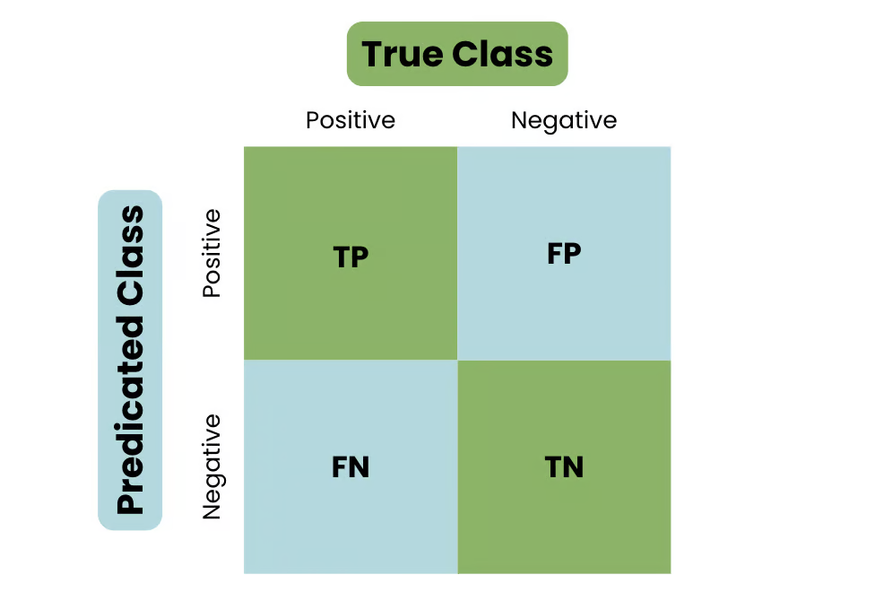

# PhD-ML-DL-LLM-Interview-Handbook

## Table of Contents

- [Machine Learning](#Machine-Learning)
    - [ML Basic](#ML-Basic)
    - [ML Algorithms](#ML-Algorithms)
        - [Algorithm Categories](#Algorithm-Categories)  
        - [Supervised Learning](#supervised-Learning)  
        - [Unsupervised Learning](#Unsupervised-Learning)  

- [Deep Learning](#Deep-Learning-Breadth)
    - [DL Basic](#dl-basic)
    - [DL Algorithms](#dl-algorithm)
- [natural Language Processing](#nlp)
- [Large Language Models](#Large-Language-Models)

 

## Machine Learning

### ML Basic
#### Gradient descent
- Gradient descent
    - concept
    - formula
    - code
- SGD
- Momentum
- RMSprop
- Adam
- AdamW
- Muon (Recent)

      
#### Loss functions
- Logistic loss function
- Cross Entropy
- Hinge loss (SVM)

#### Model evaluation and selection
- Evaluation
    - TP, FP, TN, FN

    - Metrics:
        - Accuracy: Overall correctness
        - Precision ($\frac{T P}{T P+F P}$): Out of predicted positives, how many were actually positive?
        - Recall/sensitivity/TPR ($\frac{T P}{T P+F N}$): 	Out of actual positives, how many were predicted correctly?
        - Specificity/TNR ($\frac{T N}{T N+F P}$): Out of actual negatives, how many were correctly predicted negative?
        - F1-score ($2 \times \frac{\text { Precision } \times \text { Recall }}{\text { Precision }+ \text { Recall }}$): Harmonic mean balancing precision and recall
        - **How to choose**: Accuracy is misleading with imbalanced data. Precision, if avoiding false positives is crucial (e.g., spam detection). Recall (Sensitivity), if missing a positive case is costly (e.g., cancer detection, fraud detection). F1-score, if both precision and recall matter equally. Specificity, if correctly identifying negative cases is essential (medical tests).
        - Precision vs Recall: Precision clearly matters when the cost of a FP is high. (e.g., classifying email as spam—high precision avoids wrongly marking important emails). Recall (TPR) clearly matters when the cost of missing positives (FN) is very high (e.g., disease diagnosis—high recall ensures positive cases aren't missed).

    - ROC (Receiver Operating Characteristic) curve (TPR vs FPR, threshold selection)
        - ROC curve plots TPR (Recall) vs FPR (1 - Specificity) at various threshold levels.Y-axis (TPR/Recall): Correctly identified positives; X-axis (FPR): Incorrectly identified positives (False Alarms). Choose threshold clearly to maximize TPR and minimize FPR.
    - AUC (model comparison)
        - AUC clearly measures the model’s overall capability to distinguish classes irrespective of threshold. Model with higher AUC is generally better at distinguishing classes clearly.
        - Range [0.5, 1]
    - Confusion matrix: Confusion matrix clearly visualizes all predictions vs actual classes:

    

- Bias/Variance
    - Concept
    - Underfitting/overfitting
    - Regularization
    - L0,L1,L2,L_infinity    
- Feature selection
- Data
    - Missing data
    - Imbalanced data
    - Distribution shifts
- Sampling
    - Uniform sampling
    - Negative sampling
    - Reservoir sampling
    - Stratified sampling
- Model selection
    - K-fold cross validation (good k?)

### ML Algorithms
#### Algorithm Categories
- Types by (labeled) data
    - **Supervised Learning** learn from labeled training data. Each training example consists of input features and the output label.
        - Classification: Predicts categorical outputs (e.g., spam detection, image recognition). Algorithms: Logistic regression, Decision tree, RF,KNN, SVM.
        - Regression: Predicts continuous numerial outputs. (e.g., house price prediction, stock market forecasting). Algorithms: Linear regression, RF.
    - **Unsupervised Learning** learn patterns from unlabeled data. They explore structures, clusters, or features without labels. (e.g., Customer segmentation, dimensionality reduction)
        - Clustering: K-means, DBSCAN, Hierarchical clustering.
        - Dimensionality  Reduction: PCA, t-SNE.
    - **Semi-supervised Learning** combines small amounts of labeled data with large amounts of unlabeled data. Useful when labeling data is expensive or difficult. The model leverages labeled data to guide learning, while also making use of unlabeled data to generalize better and improve performance.
    - **Reinforcement Learning** learn through trial-and-error, reward-based systems. Gaining feedback from interactive environment instead of given data.
    - **Self-supervised Learning** involves creating "pseudo-labels" from the unlabeled data itself. The model learns a meaningful representation of the data by predicting parts of the input or generating transformations of the input. (BERT)

- Parametric vs non-parametric algorithms (if we assume a fixed functional form or not) 

(Functional form = Mathematical shape or structure that the model assumes to represent how the input relates to the output.)
    - **Parametric Algorithms**(e.g., Logistic Regression, Naive Bayes, Neural Networks) assume a fixed functional form with a finite set of parameters. They are computationally efficient and often easier to interpret, but less flexible.
    - **Non-parametric methods** (e.g., KNN, Decision Trees, Random Forests) make fewer assumptions, allowing more flexibility. Their complexity grows with the data, making them suitable for capturing complex patterns.

- Linear vs Nonlinear algorithms
    - Linear algorithms (Linear Regression, Logistic Regression, Linear SVM) assume a linear relationship and provide simplicity and interpretability.
    - Nonlinear algorithms (Decision Trees, Random Forest, Neural Networks, Kernel SVM) capture more complex patterns and relationships, offering flexibility but potentially at the cost of interpretability and efficiency.

#### Supervised Learning
- Linear Algorithms
    - K-Nearest Neighbors (KNN)
        - distance 
    - Linear Regression
        - Least squares, residuals, linear vs multivariate regression 
    - Logistic Regression
        - Cost function(equation, code), sigmoid function, cross entropy
    - Support Vector Machines
    - Naive Bayes
    - Linear discriminant analysis
      
- Decision Trees
    - Logits
    - Leaves
    - Training algorithm+stop criteria
    - Inference
    - Pruning

- Ensemble methods
    - Bagging vs Boosting
    - Random Forest
    - Boosting
        - Adaboost
        - GBM
        - XGBoost

          
   

#### Unsupervised Learning
- Clustering
    - Centroid models: k-means clustering
    - Connectivity models: Hierarchical clustering
    - Density models: DBSCAN
- Gaussian mixture models
- Latent Mixture Models
- Hidden Markov Models(HMMs)
    - Markov processes
    - Transition probability and emission probability
    - Viterbi algorithm
- Dimension reduction techniques
    - PCA
    - Independent Component Analysis (ICA)
    - T-SNE   
    - UMAP    

## Deep Learning 

### DL Basic
- Loss functions in dl
    - Cross entropy
    - Mean Squared Error
- Feedforward NNs
- Backpropagation
- Dropout
    - How to apply dropout to LSTM
- Vanishing/exploding gradient problem
- Activation functions
- Regularization/ Normalization
    - Batch normalization
    - Layer normalization
    - Early stopping
- Learning Rate
    - step decay
    - exponential decay
    - consine annealing

  

### DL Algorithm
#### CNN
#### RNN
#### LSTM
- Bi-LSTM
- GRU vs LSTM
#### GAN & Autoencoders
- Generative adversarial networks details
    - Generator vs discriminator
    - Common issues (model collapse, vanishing gradients)
- Autoencoders
    - Basic
    - Variational autoencoders (VAE)
    - Reconstruction loss, KL-divergence
#### VAE
#### Transformer
- Attention
    - details
    - Self-attention
    - Cross-attention
- BERT
- RoBERTa
- GPT-2,GPT-3, GPT-4
- T5, XLNet

## NLP

### NLP Basic
#### Text pre-processing
- Tokenization
- Stemming vs lemmatization
- Stop-word
- Punctuation and noise removal
- Text normalization(lowercasing, numbers, dates)

####Text representation
- Bag-of-Words(BoW)
- TF-IDF weighting

### NLP Tasks and Algorithms
#### Language modeling
- n-gram models
- Smoothing methods (Laplace, Good-turing)

#### Text Classification
- Naive Bayes (multinomial NB)
- Logistic regression with TF-IDF
- SVM for text classification

#### Text Similarity and Information Retrieval
- Cosine similarity
- Jaccard similarity
- Document retrieval

#### NER
- CRF (Conditional Random Fields)
- HMM
- De-identification

### Topic Modeling
#### Latent Semantic Analysis (LSA)
#### Latent Dirichlet Allocation (LDA)
- Generative process intuition
- Gibbs sampling (basic intuition)

### Word Embedding (Pre-LM Era)
#### Word2Vec (CBOW and Ski-gram architectures)
#### GloVe
#### FastText (Subword embeddings)
#### Evaluation of embeddings (semantic similarity, analogy tasks)
#### Contextual embedding optimization

## Large Language Models

### LLM Basic
#### Embedding
- how to train    
- word embedding (Post-LM Era)
    - Contextual embedding (BERT, GPT embeddings)
- positional embedding
    - absolute positinal embedding
    - Relative positional embedding
    - RoPE
    - when it's not that important?

#### Tokenization
- Types
    - Byte Pair Encoding (BPE)
    - WordPiece, SentencePiece, Unigram LM tokenizer
- Vocabulary choice implications
- Tokenization impact on model perfromance (OOV handling, multilingual scenarios)

#### Architecture
- Encoder-Decoder (e.g., original Transformer, T5, BART)
- Encoder-only (e.g., BERT, RoBERTa)
- Decoder-only (e.g., GPT series)
- Comparison & use-cases for each architecture type

#### Stages
- Pre training
    - Masked Language Modeling (MLM)
    - Causal Language Modeling (CLM)
- Post training
- Data Quality and Selection
    - High-quality data selection strategies (deduplication, filtering, diversity)
    - Data cleaning techniques for LLMs
- Fine-Tuning 
    - SFT
        - Instruction Fine-Tuning (IFT)
        - SFT vs IFT
        - Dataset curation for SFT and IFT

- Alignment & Human Feedback
    - RLHF
        - Motivation behind combining SFT and RLHF
        - Human feedback collection & augmentation techniques
        - Related metrics for RLHF (reward model accuracy, preference modeling)
        - Algorithms
            - PPO
            - DPO (How DPO augments human feedback effectively)
            - KPO

    - RLAIF
        - Differences from RLHF
        - Advantages and potential risks compared to RLHF

### LLM Engineering

#### Distributed training
- Data parallel
- Pipeline parallel
- Tensor parallel
- Sequence(Activation) parallel
- ZeRO (Zero Redundancy Optimizer) parallel
- Expert (MoE) parallel
- Hybrid parallel
- Choosing the right parallelism strategy (memory, efficiency, complexity trade-offs)

| Method                     | What is Split?                  | Type of Parallelism             |
|----------------------------|---------------------------------|---------------------------------|
| **Tensor Parallelism**     | Weights/tensors                 | Model parallelism               |
| **Pipeline Parallelism**   | Layers                          | Model parallelism               |
| **Expert Parallelism (MoE)** | Experts (modules)               | Model parallelism (MoE)         |
| **Data Parallelism**       | Input data batches              | **NOT** model parallelism       |
| **ZeRO Parallelism**       | Parameters, optimizer states    | Parameter sharding (special case)|

#### Fine-Tuning
- Full fine-tuning vs Parameter-efficient fine-tuning
- When and why to freeze layers
- Layer-wise learning rates & layer freezing strategies
- SFT Data Construction 

- Catastrophic forgetting mitigation
    - add general domain data as well 1:5 - 1:10
- LoRA/QLoRA
- GPT Fine-tuning

#### Optimization and Efficiency
- Mixed precision training (FP16, BF16)
- Gradient accumulation
- Memory optimization technique (activation checkpointing, grading checkpointing)

#### Evaluation and Monitoring
- Evaluation metrics
    - Perplexity
    - Human-evaluated metrics (helpfulness, harmlessness, alignment)
    - Automated evaluation metrics (ROUGE, BLEU, BERTScore)
- Monitoring and Logging 
    - wandb
    - TensorBoard

### RAG
#### Retrieval
- Sparse retrieval (BM25, TF-IDF based retrival)
- Dense retrieval (Embedding-based retrieval)
- Hybrid retrieval

#### Embedding models
- Open-source models (SentenceTransformers, E5, GTE)
- Commericial APIs (OpenAI Embedding, Cohere embedding)
- How to choose embedding models
    - Semantic vs lexical relevance
    - Embedding dimension, speed, accuracy trade-offs
- Evaluation 
    - Retrieval accuracy metrics(Recall@k, MRR)
    - Semantic similarity tasks (STS benchmarks)

#### Chunking and Vectorization
- Importance of chunking
    - Optimal chunk size
    - Overlapping vs non-overlapping chunking
- Chunking strategies
    - Semantic chunking vs fixed-size chunking
    - Recursive chunking methods
- Impact of chunking strategy on retrieval quality and generation accuracy

#### Re-ranking
- Importance
- Methods of re-ranking
    - Cross-encoders (dense re-rankers)
    - Traditional re-ranking (score normalization ,query expansion)
    - Learned re-ranking (supervised methods)
- Evaluation
    - MAP
    - MRR
    - Precision @k

#### Generation
- Incorporating retrieved context into generation
    - prompt engineering for RAG
    - context window management
- Handling large contexts effectively
    - Fusion-in-Decoder
    - Long-context Transformers
- Mitigating hallucinations through retrieval context management

### Q&A System 
#### Types of QA Systems
- Factoid (simple answer, extractive)
- Non-factoid (explanatory, abstractive)
- Open-domain vs Closed-domain Q&A
- Traditional Q&A vs RAG vs LLM-based Q&A

#### Components of QA Systems
- Question Processing
    - Question type classification (factoid, procedural, descriptive)
    - Query parsing and expansion

- Document/Passage Retrieval
    - Dense retrieval (embedding-based retrieval)
    - Sparse retrieval (BM25, TF-IDF)
    - Hybrid approaches
    - Re-ranking of retrieved passages

- Answer Extraction/Generation
    - Extractive Q&A (span-based)
    - Generative Q&A (abstractive, using LLMs)

- Answer Post-processing
    - Summarization, filtering irrelevant answers
    - Confidence scoring and answer ranking

#### Evaluation
- Extractive Q&A Evaluation
    - Exact Match
    - F1-score
- Generative Q&A Evalution
    - ROUGE
    - BLEU
    - METEOR score
    - Human evaluation

### Reasoning
- Information seeking

### Personalized Rec-system

### Recent interesting papers

## Reference
1. [Machine Learning/Data Science Interview Cheat sheets by Aqeel Anwar](https://sites.google.com/view/datascience-cheat-sheets#h.h40dwqqwv30w)

